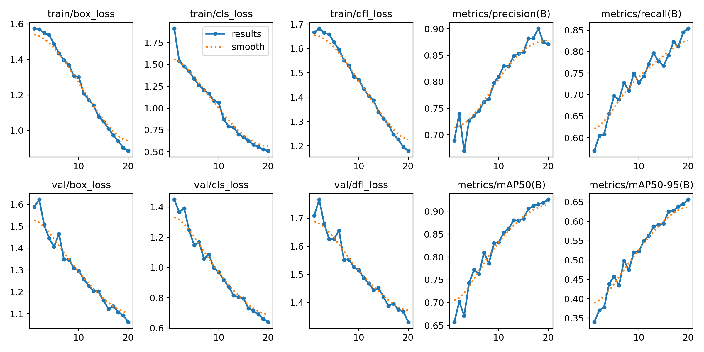
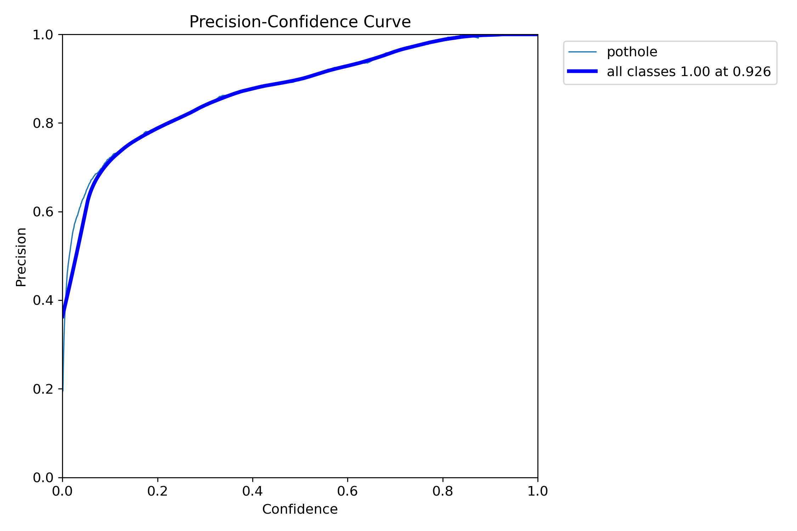
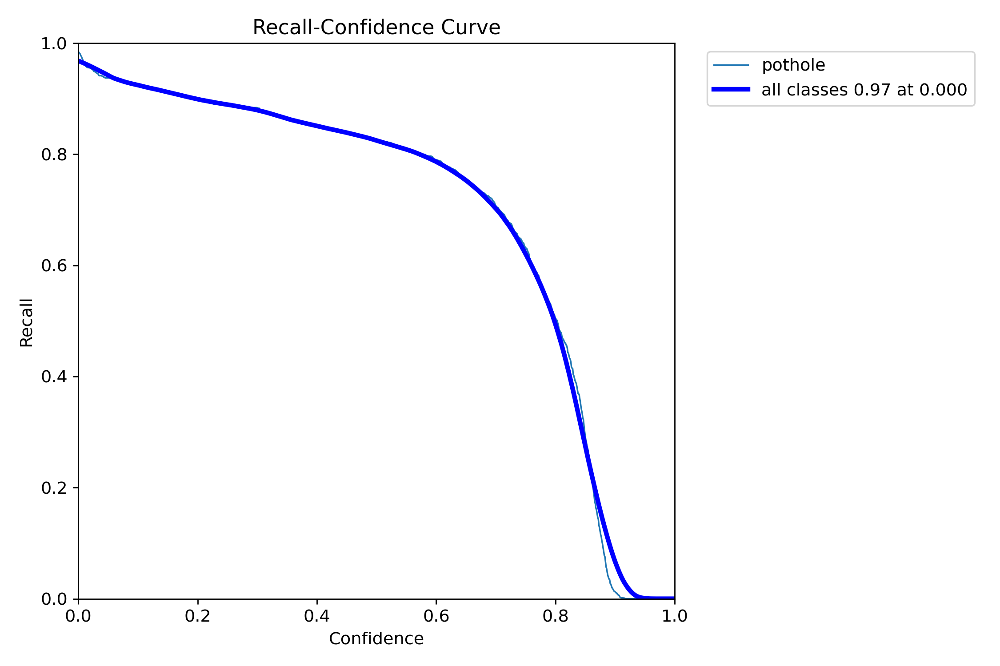
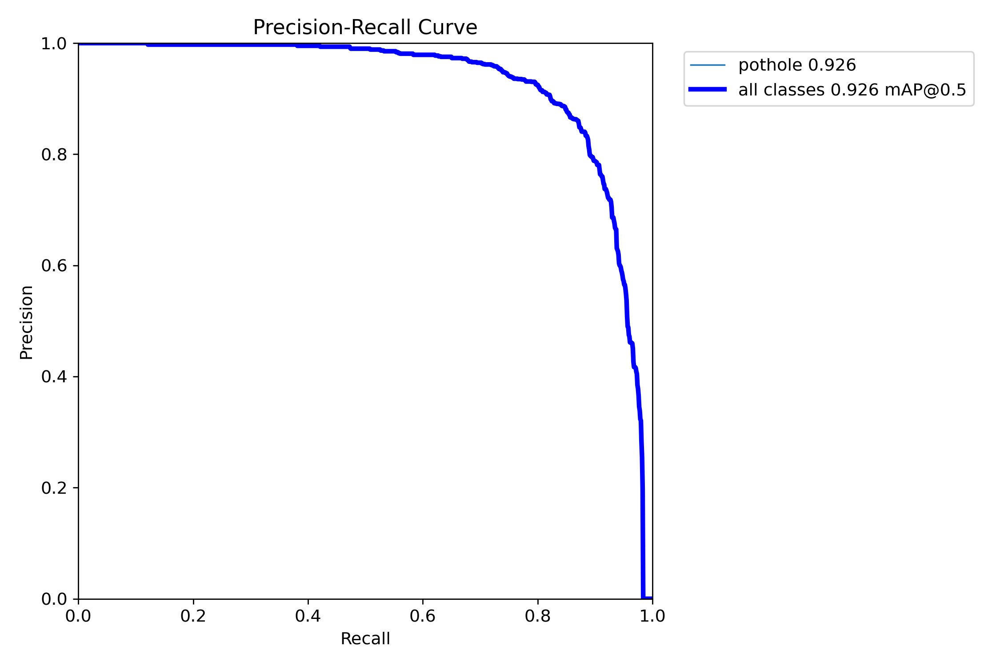
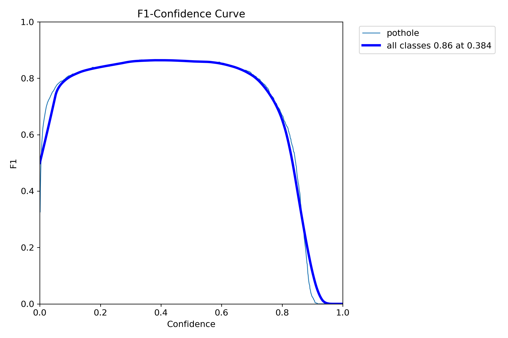

# PaveXa YOLOv12m — Model Evaluation

This document summarizes the evaluation artifacts generated during the
fine-tuning and validation of the PaveXa YOLOv12m road-damage detection model.

---

## 1. Model Overview

PaveXa uses a fine-tuned YOLOv12m object detection model for road-damage
detection.

The model was trained using the RDD2022 road-damage dataset and evaluated
using standard object-detection metrics.

The training workflow is available in:

`CV/training/PaveXa_YOLOv12m_Training.ipynb`

---

## 2. Final Evaluation Metrics

| Metric | Result |
|---|---:|
| Precision | 88.90% |
| Recall | 86.14% |
| mAP@50 | 92.36% |
| mAP@50–95 | 65.87% |

### Precision

Precision measures the proportion of predicted road-damage detections that
are actually correct.

A precision of **88.90%** indicates that the model produces relatively few
false-positive detections.

### Recall

Recall measures the proportion of actual road-damage instances successfully
detected by the model.

A recall of **86.14%** indicates that the model successfully detects most of
the relevant road-damage instances.

### mAP@50

mAP@50 measures mean Average Precision at an Intersection over Union (IoU)
threshold of 0.50.

The model achieved **92.36% mAP@50**, indicating strong detection performance
at this IoU threshold.

### mAP@50–95

mAP@50–95 evaluates the model across multiple IoU thresholds from 0.50 to
0.95.

The model achieved **65.87% mAP@50–95**.

This metric is more demanding because it evaluates localization quality at
multiple IoU thresholds.

---

# 3. Training Results

## `results.png`



This figure summarizes the model's training and validation behavior across
the training epochs.

It contains:

- Training box loss
- Training classification loss
- Training DFL loss
- Validation box loss
- Validation classification loss
- Validation DFL loss
- Precision
- Recall
- mAP@50
- mAP@50–95

### Interpretation

The training losses generally decrease throughout training, indicating that
the model is learning to localize and classify road-damage objects.

At the same time, precision, recall, mAP@50 and mAP@50–95 show an overall
upward trend.

The validation curves also improve progressively, indicating that the model
continues to improve on unseen validation data during training.

---

# 4. Precision-Confidence Curve

## `BoxP_curve.png`



The Precision-Confidence curve shows how detection precision changes as the
confidence threshold is varied.

### Interpretation

At lower confidence thresholds, the detector accepts more predictions,
which can increase the number of false positives.

As the confidence threshold increases, the precision generally increases.

The curve therefore helps identify an appropriate confidence threshold for
deployment depending on whether the application prioritizes precision or
recall.

For PaveXa, this is particularly relevant because false road-damage reports
can affect municipal maintenance prioritization.

---

# 5. Recall-Confidence Curve

## `BoxR_curve.png`



The Recall-Confidence curve shows how recall changes as the detection
confidence threshold increases.

### Interpretation

Recall is highest when the confidence threshold is low because more
potential detections are accepted.

As the confidence threshold increases, fewer detections are accepted and
recall decreases.

This curve demonstrates the trade-off between accepting more detections and
maintaining higher-confidence predictions.

---

# 6. Precision-Recall Curve

## `BoxPR_curve.png`



The Precision-Recall curve shows the relationship between precision and
recall across different confidence thresholds.

The area represented by this curve contributes to the calculation of
Average Precision.

The model achieves approximately **0.926 AP at IoU=0.50** for the pothole
class as shown in the generated evaluation plot.

### Interpretation

The curve remains at high precision across a large portion of the recall
range before declining at higher recall levels.

This indicates that the model can maintain strong precision while detecting a
large proportion of the relevant road-damage instances.

---

# 7. F1-Confidence Curve

## `BoxF1_curve.png`



The F1-confidence curve shows the F1 score at different confidence
thresholds.

F1 is the harmonic mean of precision and recall:

```text
F1 = 2 × (Precision × Recall)
     --------------------------
       Precision + Recall