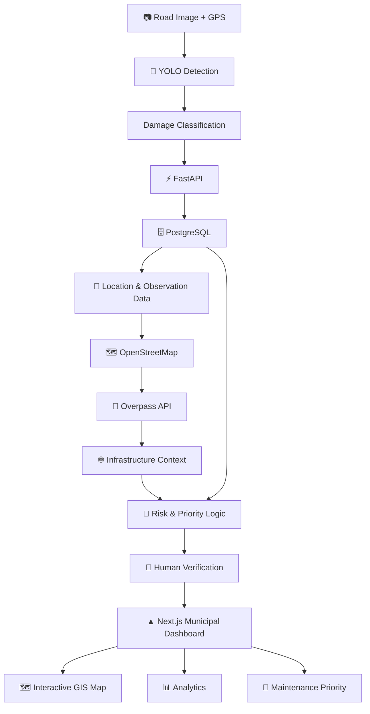

# 🚧 PaveXa — Intelligent Road Infrastructure & Maintenance

<p align="center">
  
</p>

<p align="center">
  
  
  
  
  
  
  
</p>

<p align="center">
  
  
  
  
</p>

<p align="center">
  <strong>Detect Damage • Understand Context • Prioritize Action</strong>
</p>

<p align="center">
  An AI-powered Road Risk Intelligence platform that transforms road imagery into
  <strong>actionable, geospatially-aware maintenance intelligence.</strong>
</p>

---

## 🌍 Overview

**PaveXa** is an AI-powered road-maintenance intelligence platform designed to move beyond simple road-damage detection.

A conventional road-damage system answers:

> **"Where is the damage?"**

PaveXa aims to answer the more important operational question:

> **"What does this damage mean in its geographic context, and which issue should receive attention first?"**

The platform combines:

**Computer Vision + GPS + GIS + Risk Intelligence**

to transform road imagery into structured, location-aware maintenance information.

The system brings together YOLO-based road-damage detection, GPS coordinates, PostgreSQL, OpenStreetMap/Overpass context, FastAPI services, and a Next.js municipal dashboard.

---

# 🎯 The Core Idea

```text
                    ROAD IMAGE + GPS
                           │
                           ▼
                  🤖 AI DETECTION
                           │
                           ▼
                   📍 GEOLOCATION
                           │
                           ▼
                    🗺️ GIS CONTEXT
                           │
                           ▼
                  🧠 RISK / PRIORITY
                           │
                           ▼
                   👤 HUMAN REVIEW
                           │
                           ▼
                  🚧 ACTION / REPAIR
```

<p align="center">

## 🔍 Detect Damage → 🌐 Understand Context → 🚨 Prioritize Action

</p>

> **Detection is only the beginning. Context creates intelligence.**

---

# 🏆 Built Around the Evaluation Criteria

PaveXa is designed around the five evaluation areas of the project challenge.

| Evaluation Criteria                   | How PaveXa Addresses It                                                                                                                                  |
| ------------------------------------- | -------------------------------------------------------------------------------------------------------------------------------------------------------- |
| 💡 **Innovation & Creativity — 25%**  | Goes beyond road-damage detection by combining computer vision, GIS context, geolocation, risk intelligence, and maintenance prioritization.             |
| ⚙️ **Technical Implementation — 25%** | Integrates YOLO, FastAPI, PostgreSQL, OpenStreetMap, Overpass API, GPS, and Next.js into a modular architecture.                                         |
| 🧩 **Problem-Solving Approach — 20%** | Converts isolated road-damage observations into context-aware and actionable maintenance priorities.                                                     |
| 🎨 **User Experience & Design — 15%** | Provides a municipal-facing Next.js dashboard with interactive GIS visualization, issue inspection, contextual information, and priority views.          |
| 📈 **Scalability & Impact — 15%**     | Uses a modular architecture designed to evolve from a focused prototype toward wider road monitoring, predictive analytics, and smart-city applications. |

---

# 🚦 Why PaveXa?

Road damage is visible, but visibility alone does not solve the maintenance problem.

A municipality may know that a pothole or crack exists without knowing:

* How important the damage is
* What surrounds the location
* Whether nearby infrastructure increases concern
* Which road issue should be addressed first
* Whether the AI prediction should be verified

PaveXa bridges the gap between **detection and decision-making**.

### Traditional Approach

```text
Road Image
    ↓
Detect Damage
    ↓
Bounding Box
    ↓
Done
```

### PaveXa Approach

```text
Road Image + GPS
       ↓
AI Detection
       ↓
Damage Classification
       ↓
Geospatial Association
       ↓
Road & Infrastructure Context
       ↓
Risk / Priority Signal
       ↓
Human Verification
       ↓
Maintenance Decision
```

The project's core problem is converting road-damage observations into **context-aware and actionable repair priorities**.

---

# ✨ Key Features

## 🤖 AI Road Damage Detection

PaveXa uses a YOLO-based computer-vision pipeline with the **RDD2022 road-damage dataset**.

The detection pipeline includes:

* Image acquisition / upload
* Image preprocessing
* YOLO inference
* Bounding-box localization
* Damage classification
* Confidence filtering
* Structured detection generation
* GPS and road metadata association

The objective is to transform raw visual predictions into structured road-damage observations.

---

## 📍 GPS-Based Geo-Tagging

Each road-damage observation can be associated with geographic coordinates.

```text
Latitude
Longitude
Timestamp
Image Evidence
Damage Category
Confidence
Road Association
Risk / Priority
Verification Status
```

This turns a simple AI prediction into a **spatially actionable infrastructure record**.

---

# 🗺️ GIS & Geospatial Intelligence

PaveXa uses open geographic data to understand the environment surrounding a detected road issue.

### OpenStreetMap

Provides road-network and geographic context.

### Overpass API

Retrieves selected nearby infrastructure information.

### GPS

Connects road observations to real-world geographic coordinates.

```text
                         🏫 SCHOOL
                            │
                            │
                         120m
                            │
                            ▼
                     🔴 ROAD DAMAGE
                            │
                            │
                            ▼
                        🚦 JUNCTION
                            │
                            ▼
                         MAIN ROAD
```

The project specifically considers roads, schools, hospitals, and other relevant infrastructure as contextual features.

---

# 🧠 Risk & Priority Intelligence

PaveXa does not treat model confidence as the final maintenance decision.

Instead, the risk layer considers:

```text
Damage Characteristics
          +
Geographic Context
          +
Nearby Infrastructure
          ↓
   Risk / Priority Signal
```

The risk layer is designed as **decision support**, while municipal officials remain in the decision loop.


---

# 🏙️ Municipal GIS Dashboard

The frontend is built with **Next.js** and is designed around the municipal workflow.

The dashboard provides the foundation for:

* 🗺️ Interactive GIS visualization
* 📍 Road-damage locations
* 📊 Damage statistics
* 🔎 Issue-level inspection
* 🌐 Geographic context
* 🚨 Risk / priority information
* 👤 Human verification
* 🛠️ Maintenance views

```text
                    NEXT.JS DASHBOARD
                           │
          ┌────────────────┼────────────────┐
          │                │                │
          ▼                ▼                ▼
      📊 Analytics      🗺️ GIS Map       🚨 Priority
          │                │                │
          ▼                ▼                ▼
      Statistics       Road Network     High Risk
      Damage Data      Damage Pins      Medium Risk
      Trends           Context          Low Risk
```

The documented architecture places Next.js at the client layer for the municipal dashboard and interactive GIS map.

---

# 🏗️ System Architecture



---

# 🔄 End-to-End Data Flow

### 01 — Capture

```text
Road Image + GPS Coordinates
```

### 02 — Detect

```text
YOLO
 ↓
Damage Candidates
 ↓
Bounding Boxes + Classes + Confidence
```

### 03 — Normalize

```text
AI Detections
 ↓
Structured Damage Records
```

### 04 — Geospatial Association

```text
GPS Coordinates
 ↓
Road / Road Segment
 ↓
Spatial Context
```

### 05 — Context Enrichment

```text
OpenStreetMap
      +
Overpass API
      ↓
Roads + Nearby Infrastructure
```

### 06 — Risk Evaluation

```text
Damage Characteristics
        +
Location Context
        ↓
Risk / Priority
```

### 07 — Decision Support

```text
Next.js Dashboard
        ↓
Human Verification
        ↓
Maintenance Action
```

The documented intelligence flow is **Capture → Detect → Context → Prioritize → Act**.

---

# 🧩 Technology Stack

| Layer              | Technology                   | Role                                       |
| ------------------ | ---------------------------- | ------------------------------------------ |
| 🤖 Computer Vision | **YOLO**                     | Road-damage detection & classification     |
| 📊 Dataset         | **RDD2022**                  | Road-damage training & evaluation          |
| ⚡ Backend          | **FastAPI**                  | Processing, inference orchestration & APIs |
| 🗄️ Database       | **PostgreSQL**               | Persistent application data                |
| 🗺️ GIS            | **OpenStreetMap**            | Road and geographic context                |
| 🔎 GIS API         | **Overpass API**             | Nearby infrastructure queries              |
| 🖥️ Frontend       | **Next.js**                  | Municipal dashboard & GIS interface        |
| 📍 Geolocation     | **GPS / Latitude-Longitude** | Geo-tagging road observations              |

---

# 📊 Model Performance

PaveXa's final evaluated model achieved:

| Metric        |     Result |
| ------------- | ---------: |
| **Precision** | **88.90%** |
| **Recall**    | **86.14%** |
| **mAP@50**    | **92.36%** |
| **mAP@50:95** | **65.87%** |

### Performance Snapshot

```text
Precision
██████████████████░░  88.90%

Recall
█████████████████░░░  86.14%

mAP@50
██████████████████░░  92.36%

mAP@50:95
█████████████░░░░░░░  65.87%
```

These are the final model-performance results documented in the project report.

---

# 📈 System Evaluation

PaveXa evaluates more than model performance.

| Evaluation Area           | Evidence                                                          |
| ------------------------- | ----------------------------------------------------------------- |
| 🤖 **Detection Quality**  | Precision, Recall, mAP@50, mAP@50:95                              |
| 📍 **Geolocation**        | GPS capture and road association                                  |
| 🗺️ **Context Retrieval** | Road and nearby infrastructure retrieval                          |
| ⚡ **API Reliability**     | Request/response flow across inference, persistence and dashboard |
| 👤 **Human Validation**   | Review and verification of AI-assisted outputs                    |

This provides an **end-to-end evaluation perspective**, rather than evaluating only the computer-vision model.

---


### Demonstration Flow

```text
📷 Upload Road Image
        ↓
🤖 Detect Road Damage
        ↓
📍 Attach GPS Coordinates
        ↓
🗺️ Retrieve GIS Context
        ↓
🧠 Generate Risk / Priority
        ↓
👤 Human Verification
        ↓
🚧 Maintenance Decision
```

---

# ⚡ Backend Architecture

FastAPI acts as the application and processing layer between the frontend, AI pipeline, database, and external mapping services.

```text
                    Next.js
                       │
                       ▼
                    FastAPI
                       │
          ┌────────────┼────────────┐
          │            │            │
          ▼            ▼            ▼
        YOLO       PostgreSQL    GIS APIs
      Inference       │        OSM / Overpass
          │           │            │
          └───────────┼────────────┘
                      ▼
               Risk / Priority
                      │
                      ▼
               Next.js Dashboard
```

The backend is responsible for receiving inputs, invoking inference, validating and normalizing outputs, persisting observations, retrieving geographic context, exposing risk information, and serving structured responses to the dashboard.

---


# 📁 Project Structure

```text
PaveXa/
│
├── ai/
│   ├── models/
│   │   └── PaveXa_model.pt
│   │
│   ├── .venv/
│   ├── __pycache__/
│   ├── .env
│   ├── .python-version
│   ├── agent.py
│   ├── ai_service.py
│   ├── data_service.py
│   ├── groq_client.py
│   ├── mock_data.json
│   └── requirements.txt
│
├── client/
│   ├── app/
│   ├── components/
│   ├── db/
│   ├── drizzle/
│   ├── hooks/
│   ├── lib/
│   ├── public/
│   ├── .gitignore
│   ├── components.json
│   ├── drizzle.config.ts
│   ├── eslint.config.mjs
│   ├── next.config.ts
│   ├── package-lock.json
│   ├── package.json
│   ├── postcss.config.mjs
│   └── tsconfig.json
│
├── CV/
│   ├── results/
│   ├── training/
│   ├── .gitkeep
│   └── MODEL_EVALUATION.md
│
├── server/
│   ├── app/
│   │   ├── risk_engine/
│   │   ├── routes/
│   │   ├── schemas/
│   │   ├── services/
│   │   ├── __pycache__/
│   │   └── main.py
│   │
│   ├── test_priority.py
│   ├── test_risk.py
│   ├── test_yolo_adapter.py
│   ├── run.bat
│   └── test_gis.py
│
├── .gitattributes
├── .gitignore
├── bash.exe.stackdump
├── README.md
└── requirements.txt
```

> **Note:** Large datasets and model checkpoints such as `best.pt` and `last.pt` should not be committed directly to Git. Use appropriate model/artifact storage instead.

---

# ⚙️ Installation

## 1. Clone the Repository

```bash
git clone <YOUR_REPOSITORY_URL>

cd PaveXa
```

---

## 2. Backend Setup

```bash
cd backend

python -m venv venv
```

### Windows

```bash
venv\Scripts\activate
```

### Linux / macOS

```bash
source venv/bin/activate
```

Install dependencies:

```bash
pip install -r requirements.txt
```

Run the FastAPI server:

```bash
uvicorn app.main:app --reload
```

API documentation:

```text
http://localhost:8000/docs
```

---

# 🖥️ Frontend Setup

```bash
cd frontend

npm install

npm run dev
```

The Next.js municipal dashboard will then be available through the local development server.

---

# 🔐 Environment Variables

Create a `.env` file:

```env
DATABASE_URL=your_postgresql_connection_string

MODEL_PATH=path/to/best.pt

OVERPASS_API_URL=your_overpass_endpoint

CORS_ORIGINS=http://localhost:3000
```

Never commit:

```text
.env
API keys
Database credentials
Private tokens
Production secrets
```

---

# 🤖 Model Development Pipeline

```text
RDD2022 Dataset
      ↓
Dataset Preparation
      ↓
Annotation Validation
      ↓
YOLO Training
      ↓
Validation
      ↓
Model Evaluation
      ↓
Best Checkpoint
      ↓
FastAPI Inference
      ↓
PaveXa Application
```

The documented methodology covers dataset preparation, YOLO training and evaluation, checkpoint preservation, API integration, geospatial persistence, GIS context, risk logic, dashboard integration, and validation of the complete system.

---

# 📈 Scalability

PaveXa is intentionally designed as a modular system.

```text
                         PaveXa
                           │
             ┌─────────────┼─────────────┐
             │             │             │
             ▼             ▼             ▼
          AI Layer      API Layer     GIS Layer
             │             │             │
             ▼             ▼             ▼
           YOLO          FastAPI     OSM / Overpass
                           │
                           ▼
                      PostgreSQL
```

The architecture can evolve from a focused prototype toward wider city coverage while keeping the major components modular. The project documentation also identifies wider road monitoring and advanced analytics as future directions.

---

# 🌆 Smart City Potential

PaveXa can act as a **road-maintenance intelligence layer** within a broader smart-city ecosystem.

```text
                  SMART CITY
                       │
          ┌────────────┼────────────┐
          │            │            │
          ▼            ▼            ▼
      🚦 Traffic    🚧 PaveXa    🏥 Public
       Systems       Roads       Infrastructure
          │            │            │
          └────────────┼────────────┘
                       ▼
                GEOSPATIAL DATA
                       │
                       ▼
               URBAN INTELLIGENCE
```

Potential applications include:

* Municipal road inspection
* Smart-city infrastructure monitoring
* Road safety analysis
* Maintenance prioritization
* Infrastructure planning
* Large-scale road-condition monitoring

---

# 🛣️ Roadmap

## 🟢 Phase 01 — MVP

* [x] YOLO road-damage detection
* [x] RDD2022 dataset integration
* [x] GPS-based localization
* [x] FastAPI architecture
* [x] PostgreSQL integration
* [x] OpenStreetMap integration
* [x] Overpass API integration
* [x] Next.js municipal dashboard

## 🟡 Phase 02 — Intelligence

* [ ] Advanced risk scoring
* [ ] Maintenance priority ranking
* [ ] City-wide road-risk heatmaps
* [ ] Historical road-condition analysis
* [ ] Road deterioration tracking

## 🟠 Phase 03 — Smart Mobility

* [ ] Risk-aware navigation
* [ ] Safer route recommendation
* [ ] Emergency-vehicle routing
* [ ] Real-time road-risk updates
* [ ] Weather-aware road-risk analysis

## 🔴 Phase 04 — Predictive Infrastructure

* [ ] Predict future road deterioration
* [ ] Repair verification using new imagery
* [ ] Municipal work-order integration
* [ ] CCTV-based monitoring
* [ ] Dashcam-based inspection
* [ ] Fleet-based road monitoring
* [ ] Advanced infrastructure analytics

These future directions align with the project's documented scope, including risk-aware routing, real-time road-risk updates, predictive deterioration, weather-aware risk, emergency routing, city-wide heatmaps, repair verification, municipal integration, and wider road monitoring.

---

# ⚠️ Limitations

PaveXa currently has several practical limitations:

* Computer-vision performance depends on image quality, lighting, viewpoint, road conditions, and dataset coverage.
* OpenStreetMap/Overpass context depends on mapped-feature availability and accuracy.
* GPS inaccuracies can affect road association.
* Risk scoring should be calibrated against local municipal policies.
* AI-assisted prioritization should be reviewed by authorized personnel before major maintenance decisions.

---

# 📊 Expected Impact

PaveXa is designed around four practical impact areas:

| Impact                     | Contribution                                  |
| -------------------------- | --------------------------------------------- |
| 🛡️ **Safety**             | Focus attention on higher-risk road issues    |
| ⚡ **Efficiency**           | Reduce manual inspection triage               |
| 💰 **Resource Allocation** | Help prioritize maintenance                   |
| 📋 **Accountability**      | Maintain verification and maintenance records |

---

# 🧠 What Makes PaveXa Different?

### ❌ A basic road-damage detector

```text
Image
  ↓
Pothole
  ↓
Bounding Box
```

### ✅ PaveXa

```text
                     ROAD IMAGE
                          │
                          ▼
                  🤖 AI DETECTION
                          │
                          ▼
                   📍 GEOLOCATION
                          │
                          ▼
                    🗺️ GIS CONTEXT
                          │
               ┌──────────┴──────────┐
               ▼                     ▼
             Roads             Infrastructure
                                    │
                            Schools / Hospitals
                                    │
               └──────────┬──────────┘
                          ▼
                  🧠 RISK / PRIORITY
                          │
                          ▼
                    👤 HUMAN REVIEW
                          │
                          ▼
                    🚧 MAINTENANCE
```

> **Detection is only the beginning. Context creates intelligence.**

---

# 👥 Team

<p align="center">

### 👨‍💻 Arnesh Bera

**Team Lead**

### 👨‍💻 Abhirup Ghosh

**Team Member**

</p>

**Project:** PaveXa
**Category:** Smart City • AI/ML • Computer Vision • GIS • Geospatial Intelligence

**Prepared for:** Prasunethon 2.0


---

# 📚 References & Technology Sources

1. **RDD2022** — Road Damage Dataset
2. **Ultralytics YOLO** — Object detection and training ecosystem
3. **FastAPI** — Python API and service layer
4. **PostgreSQL** — Relational persistence
5. **OpenStreetMap** — Geographic and road-network data
6. **Overpass API** — OpenStreetMap feature queries
7. **Next.js** — Frontend and municipal dashboard

---

# 🏆 Project Vision

PaveXa addresses a fundamental weakness in conventional road-damage detection:

> **Identifying damage is not the same as deciding what should happen next.**

By connecting:

```text
🤖 Computer Vision
        +
📍 GPS
        +
🗺️ GIS Context
        +
🧠 Risk Prioritization
        +
👤 Human Verification
        ↓
🚧 ROAD MAINTENANCE INTELLIGENCE
```

PaveXa creates a path from:

## **Visual Evidence → Geographic Context → Actionable Maintenance Intelligence**

---

<p align="center">

# 🚧 PaveXa

### Detect Damage • Understand Context • Prioritize Action

**Building a smarter, safer and more data-driven approach to road maintenance.**

<br/>


<br/><br/>

⭐ **Star this repository if you find PaveXa interesting.**

</p>
